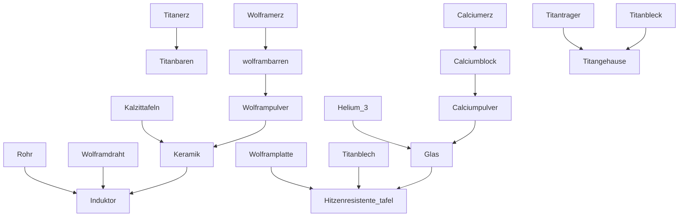

```mermaid
graph TD;
    Titanerz-->Titanbaren;
    Wolframerz-->wolframbarren;
    Calciumerz-->Calciumblock;
    wolframbarren-->Wolframpulver;
    Calciumblock-->Calciumpulver;
    Kalzittafeln-->Keramik
    Wolframpulver-->Keramik;
    Titantrager-->Titangehause;
    Titanbleck-->Titangehause;
    Helium_3-->Glas
    Calciumpulver-->Glas;
    Rohr-->Induktor;
    Wolframdraht-->Induktor;
    Keramik-->Induktor;
    Wolframplatte-->Hitzenresistente_tafel;
    Titanblech-->Hitzenresistente_tafel;
    Glas-->Hitzenresistente_tafel;
```