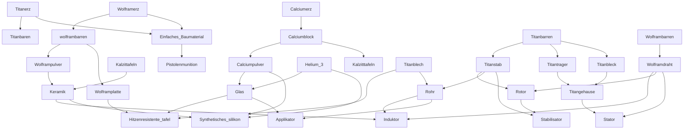

```mermaid
graph TD;
    Titanerz-->Titanbaren;
    Wolframerz-->wolframbarren;
    Calciumerz-->Calciumblock;
    wolframbarren-->Wolframpulver;
    Calciumblock-->Calciumpulver;
    Kalzittafeln-->Keramik
    Wolframpulver-->Keramik;
    Titantrager-->Titangehause;
    Titanbleck-->Titangehause;
    Helium_3-->Glas
    Calciumpulver-->Glas;
    Rohr-->Induktor;
    Wolframdraht-->Induktor;
    Keramik-->Induktor;
    Wolframplatte-->Hitzenresistente_tafel;
    Titanblech-->Hitzenresistente_tafel;
    Glas-->Hitzenresistente_tafel;
    Calciumpulver-->Synthetisches_silikon;
    Helium_3-->Synthetisches_silikon;
    Keramik-->Synthetisches_silikon;
    Wolframerz-->Einfaches_Baumaterial;
    Titanerz-->Einfaches_Baumaterial;
    Einfaches_Baumaterial-->Pistolenmunition;
    Titanbarren-->Titanstab;
    Wolframbarren-->Wolframdraht;
    Calciumblock-->Kalzitttafeln;
    Titanbarren-->Titantrager;
    Titanbarren-->Titanbleck;
    wolframbarren-->Wolframplatte;
    Titanstab-->Rotor;
    Wolframdraht-->Rotor;
    Titanstab-->Rohr;
    Titanblech-->Rohr;
    Rotor-->Stabilisator;
    Titanstab-->Stabilisator;
    Titangehause-->Stator;
    Wolframdraht-->Stator;
    Rohr-->Applikator;
    Glas-->Applikator;
```