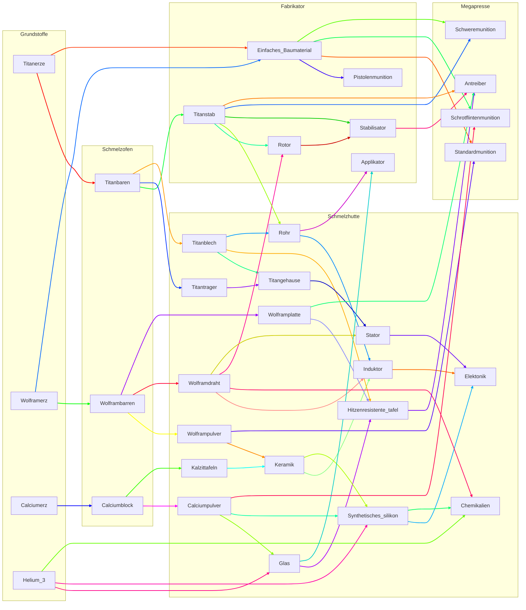

```mermaid
---
config:
  flowchart:
    
---
graph LR;
    subgraph Grundstoffe
        Titanerze;
        Wolframerz;
        Calciumerz;
        Helium_3;
    end
    subgraph Schmelzofen
        Titanerze--> Titanbaren;
        Wolframerz-->Wolframbarren;
        Calciumerz-->Calciumblock;
    end
    subgraph Schmelzhutte
        Wolframbarren-->Wolframpulver;
        Calciumblock-->Calciumpulver;
        Kalzittafeln-->Keramik
        Wolframpulver-->Keramik;
        Titantrager-->Titangehause;
        Titanblech-->Titangehause;
        Helium_3-->Glas
        Calciumpulver-->Glas;
        Rohr-->Induktor;
        Wolframdraht-->Induktor;
        Keramik-->Induktor;
        Wolframplatte-->Hitzenresistente_tafel;
        Titanblech-->Hitzenresistente_tafel;
        Glas-->Hitzenresistente_tafel;
        Calciumpulver-->Synthetisches_silikon;
        Helium_3-->Synthetisches_silikon;
        Keramik-->Synthetisches_silikon;
        Synthetisches_silikon-->Elektonik;
        Induktor-->Elektonik;
        Stator-->Elektonik;
        Synthetisches_silikon-->Chemikalien;
        Wolframdraht-->Chemikalien;
        Helium_3-->Chemikalien;
    end
    subgraph Fabrikator
        Wolframerz-->Einfaches_Baumaterial;
        Titanerze-->Einfaches_Baumaterial;
        Einfaches_Baumaterial-->Pistolenmunition;
        Titanbaren-->Titanstab;
        Wolframbarren-->Wolframdraht;
        Calciumblock-->Kalzittafeln;
        Titanbaren-->Titantrager;
        Titanbaren-->Titanblech;
        Wolframbarren-->Wolframplatte;
        Titanstab-->Rotor;
        Wolframdraht-->Rotor;
        Titanstab-->Rohr;
        Titanblech-->Rohr;
        Rotor-->Stabilisator;
        Titanstab-->Stabilisator;
        Titangehause-->Stator;
        Wolframdraht-->Stator;
        Rohr-->Applikator;
        Glas-->Applikator;
    end
    subgraph Megapresse
        Einfaches_Baumaterial-->Standardmunition;
        Wolframpulver-->Standardmunition;
        Einfaches_Baumaterial-->Schrotflintenmunition;
        Calciumpulver-->Schrotflintenmunition;
        Einfaches_Baumaterial-->Schweremunition;
        Titanstab-->Schweremunition;
        Titanstab-->Antreiber;
        Hitzenresistente_tafel-->Antreiber;
        Wolframplatte-->Antreiber;
        Stabilisator-->Antreiber;
    end

linkStyle 0 stroke:#ff0000,stroke-width:2px
linkStyle 1 stroke:#00ff00,stroke-width:2px
linkStyle 2 stroke:#0000ff,stroke-width:2px
linkStyle 3 stroke:#ffff00,stroke-width:2px
linkStyle 4 stroke:#ff00ff,stroke-width:2px
linkStyle 5 stroke:#00ffff,stroke-width:2px
linkStyle 6 stroke:#ff8800,stroke-width:2px
linkStyle 7 stroke:#8800ff,stroke-width:2px
linkStyle 8 stroke:#00ff88,stroke-width:2px
linkStyle 9 stroke:#ff0088,stroke-width:2px
linkStyle 10 stroke:#88ff00,stroke-width:2px
linkStyle 11 stroke:#0088ff,stroke-width:2px
linkStyle 12 stroke:#ff8888,stroke-width:2px
linkStyle 13 stroke:#88ff88,stroke-width:2px
linkStyle 14 stroke:#8888ff,stroke-width:2px
linkStyle 15 stroke:#ffaa00,stroke-width:2px
linkStyle 16 stroke:#aa00ff,stroke-width:2px
linkStyle 17 stroke:#00ffaa,stroke-width:2px
linkStyle 18 stroke:#ff00aa,stroke-width:2px
linkStyle 19 stroke:#aaff00,stroke-width:2px
linkStyle 20 stroke:#00aaff,stroke-width:2px
linkStyle 21 stroke:#ff6600,stroke-width:2px
linkStyle 22 stroke:#6600ff,stroke-width:2px
linkStyle 23 stroke:#00ff66,stroke-width:2px
linkStyle 24 stroke:#ff0066,stroke-width:2px
linkStyle 25 stroke:#66ff00,stroke-width:2px
linkStyle 26 stroke:#0066ff,stroke-width:2px
linkStyle 27 stroke:#ff3300,stroke-width:2px
linkStyle 28 stroke:#3300ff,stroke-width:2px
linkStyle 29 stroke:#00ff33,stroke-width:2px
linkStyle 30 stroke:#ff0033,stroke-width:2px
linkStyle 31 stroke:#33ff00,stroke-width:2px
linkStyle 32 stroke:#0033ff,stroke-width:2px
linkStyle 33 stroke:#ff9900,stroke-width:2px
linkStyle 34 stroke:#9900ff,stroke-width:2px
linkStyle 35 stroke:#00ff99,stroke-width:2px
linkStyle 36 stroke:#ff0099,stroke-width:2px
linkStyle 37 stroke:#99ff00,stroke-width:2px
linkStyle 38 stroke:#0099ff,stroke-width:2px
linkStyle 39 stroke:#cc0000,stroke-width:2px
linkStyle 40 stroke:#00cc00,stroke-width:2px
linkStyle 41 stroke:#0000cc,stroke-width:2px
linkStyle 42 stroke:#cccc00,stroke-width:2px
linkStyle 43 stroke:#cc00cc,stroke-width:2px
linkStyle 44 stroke:#00cccc,stroke-width:2px
linkStyle 45 stroke:#ff5500,stroke-width:2px
linkStyle 46 stroke:#5500ff,stroke-width:2px
linkStyle 47 stroke:#00ff55,stroke-width:2px
linkStyle 48 stroke:#ff0055,stroke-width:2px
linkStyle 49 stroke:#55ff00,stroke-width:2px
linkStyle 50 stroke:#0055ff,stroke-width:2px
linkStyle 51 stroke:#ff7700,stroke-width:2px
linkStyle 52 stroke:#7700ff,stroke-width:2px
linkStyle 53 stroke:#00ff77,stroke-width:2px
linkStyle 54 stroke:#ff0077,stroke-width:2px

```